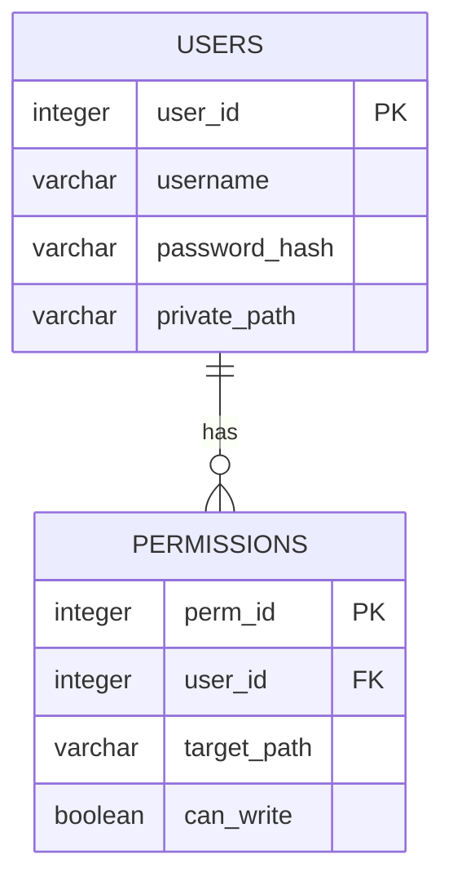

# DB テーブル設計

## user or account テーブル (仮)
| カラム | 型 | デフォルト値 | 説明 |
| :--- | :--- | :--- | :--- |
| id | integer | - | ユーザーID (PK) |
| username | varchar | "anonymous" | ユーザー名 |
| password_hash | varchar | NULL | パスワードのハッシュ値 |
| private_path | varchar | "/" | 個人dirパス |

## DB リレーション (仮)
